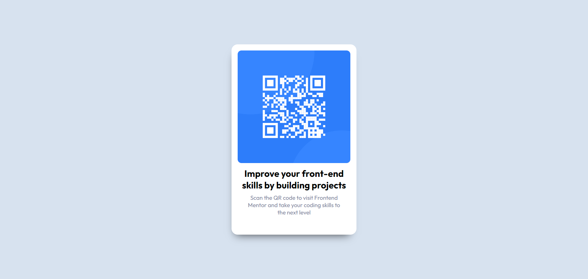
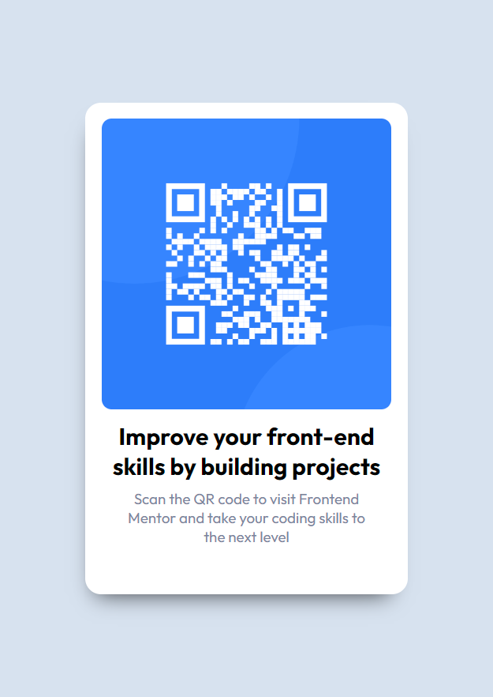

# Front-end Mentor QR Code Component Project Solution

The following files and folders in this repo is my solution to the QR Code Component project which is hosted by the gracious folks over at [https://www.frontendmentor.io/challenges/qr-code-component-iux_sIO_H]. It is to be noted that Frontend Mentor is an excellent place for one to hone his frontend skills and to take them to the next level.

## Tabel of Contents

- [Project Overview](#project_overview)
  - [Screenshots](#screenshots)
  - [Links](#links)
- [My Processes](#my-processes)
  - [Built With The Following](#built-with-the-following)
  - [What I Learned](#what-i-learned)
  - [Continued Development](#continued-development)
  - [Useful Resources](#useful-resources)
- [Author](#author)
- [Acknoledgements](#acknowledgements)

## Project Overwiew

### Screenshots


Desktop Preview



Mobile Preview

### Links

- Solution URL: [https://github.com/mohammadArafat03/qr_code_component/tree/main](https://github.com/mohammadArafat03/qr_code_component/tree/main)
- Live Site URL: [https://mohammadarafat03.github.io/qr_code_component/](https://mohammadarafat03.github.io/qr_code_component/)

## My Processes

### Built With The Following

- Semantic HTML5 Markup
- Sass CSS extension
- Flexbox
- Mobile-first Workflow
- [https://cssgenerator.org/](https://cssgenerator.org/) - For getting the box shadow 'cause FRIK!

### What I learned

This is a very good way to start any frontend journey. The component was not very hard to build and you have to have a good foundation of HTML and CSS to finish this. While building this, I learned how to create and use Sass variables and and got a better understanding of flexbox and containers. Overall, it was a pretty good beginners challenge and I enjoyed making the QR Code component. This is also a way to get the hang of writing markdown documents which is also cool.

---
***html snippet***
```html
<div> // Main container centering the child containers with flexbox
    <div></div> // Child containers with child elements centered accordingly with flexbox
    <div></div> // """
    <div></div> // """
</div>
```

***sass variable snippet***
```sass
$variale_name: property;

...

background-color: $varible_name;
```
---

### Continued Development

By finishing this project the following will be in effect:
- Making more robust HTLM5 pages by following BEM (Box Element Model).
- Properly understanding more about Mobile-first approach in temrs of CSS and responsiveness.
- Continue using Sass and learning more of the utilities and benefits provided by Sass.
- Discovery of more tools like [https://cssgenerator.org/](https://cssgenerator.org/) to make life a lot easier in some aspects of workflow.

## Author

- Website - [https://mohammadarafat03.github.io/qr_code_component/](https://mohammadarafat03.github.io/qr_code_component/)
- Frontend Mentor - [@mohammadArafat03](https://www.frontendmentor.io/profile/mohammadArafat03)

## Acknowledgements

None at the moment for this project but this may change in the future...
